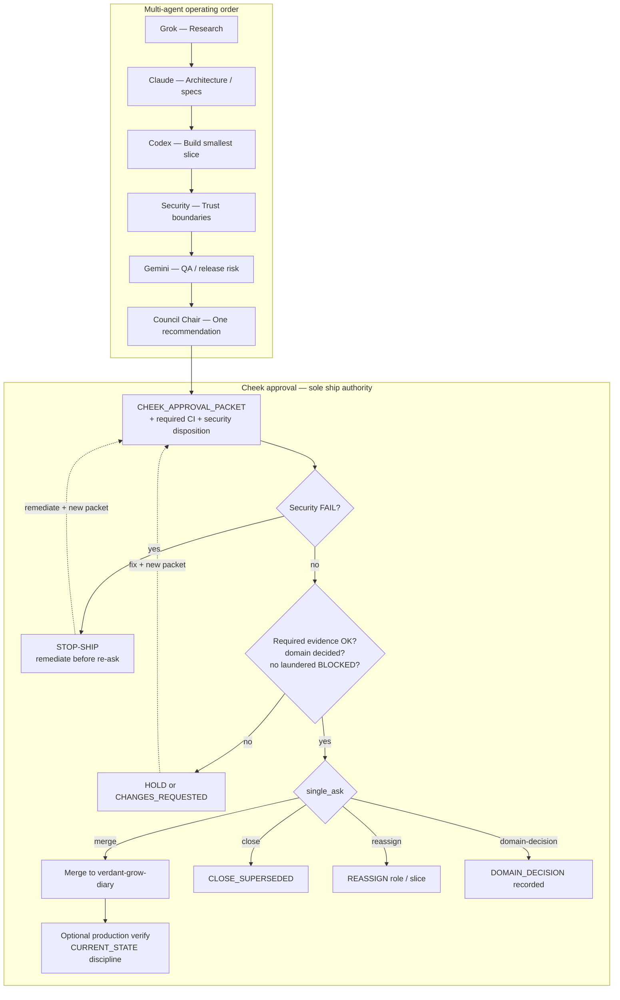
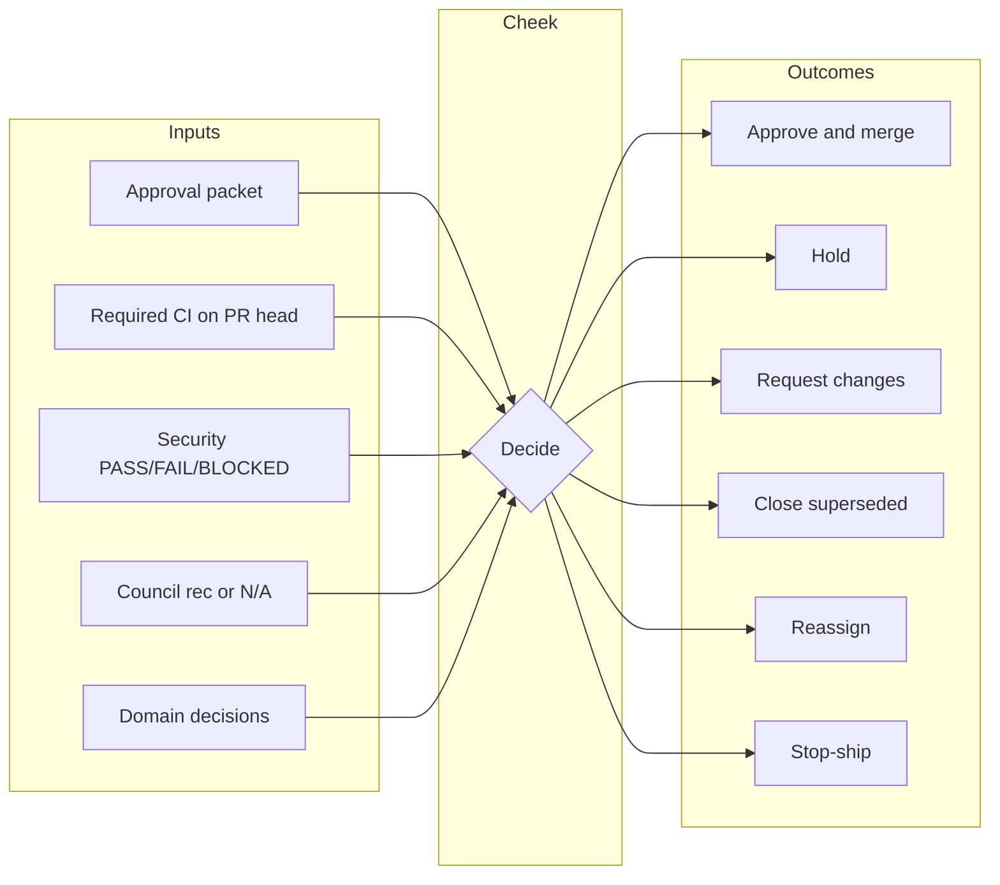
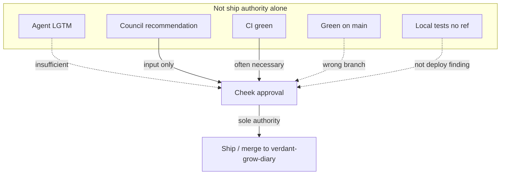

# Cheek Approval Workflow

**Sentinel-Version:** align with `AGENTS.md` (currently `2026-08-01.7` when this
doc was written; bump only if the constitution’s ship-authority rules change).

**Authority:** This document describes how **Cheek** (product owner / releaser)
approves work for Verdant. It does **not** grant any agent merge, deploy, or
role-reassignment power. Agents recommend; **only Cheek approves what ships**.

**Related:**

| Doc | Role |
|-----|------|
| [`AGENTS.md`](../../AGENTS.md) | Constitution; pipeline ends at Cheek approval |
| [`HANDOFF_PROTOCOL.md`](./HANDOFF_PROTOCOL.md) | Serial handoffs; Council recommends |
| [`roles/council-chair.md`](./roles/council-chair.md) | One recommendation for Cheek |
| [`CURRENT_STATE.md`](./CURRENT_STATE.md) | Deploy branch + production verification state |
| [`.github/pull_request_template.md`](../../.github/pull_request_template.md) | Per-PR review surface |
| [`docs/v0-release-validation-checklist.md`](../v0-release-validation-checklist.md) | V0 merge checklist |
| [`docs/security-checklist.md`](../security-checklist.md) | General security gate |
| [`docs/bridge-sensor-ingest-security-audit-checklist.md`](../bridge-sensor-ingest-security-audit-checklist.md) | Bridge / live-ingest (when present) |
| [`docs/bridge-trust-phase-a-freshness-checklist.md`](../bridge-trust-phase-a-freshness-checklist.md) | Freshness Phase A (when present) |

---

## 1. Who Cheek is

**Cheek** is the human product owner for Verdant (GitHub actor typically
`cheekhimself`). In multi-agent operations:

| Power | Cheek | Agents / Council |
|-------|-------|------------------|
| Approve what ships | **Yes — sole** | No |
| Reassign agent roles | **Yes — sole** | No (unless Cheek reassigns) |
| Domain product decisions (e.g. 15m vs 30m live UI) | **Yes** | May recommend only |
| Merge / close / comment as owner | **Yes** | Only if Cheek grants or executes |
| Security stop-ship | Accepts Security `FAIL` as binding | Security may declare `FAIL`; cannot ship over it |
| Production “it is live and healthy” claims | **Yes**, with evidence | Never invent deploy/index/traffic outcomes |

Council Chair **recommends**. It does **not** release.

---

## 2. Place in the operating order

Default sequence ([`AGENTS.md`](../../AGENTS.md) / [`HANDOFF_PROTOCOL.md`](./HANDOFF_PROTOCOL.md)):

```text
Research (Grok)
  → Architecture (Claude)
    → Build (Codex)
      → Security Review (stop-ship on FAIL)
        → QA Audit (Gemini)
          → Council (one recommendation)
            → Cheek approval          ← terminal human gate
              → merge / hold / close / reassign / ship-verify
```

Scoped work may use a **subset** of roles. Parallel implementation of the same
slice is a protocol failure — Cheek should reject “two agents both shipping X.”

**Deploy branch:** production ships from **`verdant-grow-diary`**, not from an
assumption that `main` is production parity. Findings and merges must name the
ref.

**Visual overview:** see [§12 Flow diagrams](#12-flow-diagrams) (Mermaid).

---

## 3. What Cheek is deciding

Cheek decides whether **evidence** supports shipping **this slice** (or taking
another explicit action). Not whether an agent “liked” the work.

### 3.1 Required mental checklist

1. **What is the single ask?** merge · hold · close · reassign · domain decision  
2. **What is explicitly not being asked?** (scope discipline)  
3. **Security:** any `FAIL`? → stop-ship until remediated  
4. **Blockers:** any `BLOCKED` axis still open? → cannot launder to PASS  
5. **Required CI** on the PR **head** (not a different branch)  
6. **Domain decisions** agents cannot average (product windows, ship/no-ship)  
7. **Ref:** deploy-branch SHA / PR head named  
8. **Risk / rollback** acceptable  
9. **Council** (if full pipeline): one recommendation, one next_slice  

### 3.2 Status vocabulary (reject laundering)

Use literally — never upgrade blocked/unmeasured into pass:

| Status | Meaning |
|--------|---------|
| `PASS` | Direct evidence verified the check |
| `FAIL` | Direct evidence verified a defect |
| `BLOCKED` | Access/permission/dependency prevented verification |
| `NO_BASELINE` | No earlier measurement for comparison |
| `NO_DATA` | Source reachable but empty |
| `NOT_MEASURED` | Not measured; never a perfect score |
| `SKIPPED` | Intentionally not run; reason required |
| `NOT_APPLICABLE` | Check does not apply |

Never invent search volume, traffic, indexing, sensor health, or deployment
outcomes. Require authorized source + provenance.

---

## 4. Inputs Cheek should receive

### 4.1 Minimum package (any non-trivial PR)

- Link to PR against **`verdant-grow-diary`**
- Filled [PR template](../../.github/pull_request_template.md) sections
- Required CI summary: green list + red list (**required vs non-required**)
- Tests with **exact** pass counts (or docs-only exception)
- Risk / rollback notes
- Security checklist disposition

### 4.2 Full multi-agent slice

- All five handoffs (or explicit N/A with reason)
- Council synthesis: one paragraph recommendation first
- Security `PASS` / `FAIL` / `BLOCKED`
- Gemini claim audit (CI ≠ production ≠ indexing)

### 4.3 Paste-ready packet (agents → Cheek)

```text
CHEEK_APPROVAL_PACKET
sentinel_version:
date:
slice:
ref_or_pr:
base_branch: verdant-grow-diary

council_recommendation: (one paragraph or N/A + why)
security: PASS | FAIL | BLOCKED
qa_gemini: PASS | FAIL | BLOCKED | N/A

required_ci:
  green:
    - ...
  red_required:
    - ...
  red_non_required:
    - ...

domain_decisions_needed:
  - ...

risk_rollback:
single_ask: merge | hold | close | reassign | domain-decision
explicitly_not_asking:
verified_by:
  - commands/artifacts + SHAs
blockers:
  - axis / owner / unblock
```

---

## 5. Decision outcomes

| Outcome | When to use | Effect |
|---------|-------------|--------|
| **Approve & merge** | Evidence supports the slice; required gates OK | Land on `verdant-grow-diary` |
| **Approve with follow-up** | Slice is good; next work is separate | Merge A; record next_slice + owner |
| **Hold** | Missing evidence, open BLOCKED, or domain undecided | Do not merge; do not re-label PASS |
| **Request changes** | Fixable defects | Hand back to role owner with concrete list |
| **Close superseded** | Residual is noise or would regress base | Close with comment; link replacement |
| **Reassign** | Wrong owner or parallel blur | Explicit role reassignment |
| **Stop-ship** | Security `FAIL` or critical trust break | No merge until remediated |
| **Do not proceed** | Evidence insufficient for any ship claim | Honest hold |

Cheek may execute merges/closes personally or authorize a session/tool under
owner control. **Authority** remains Cheek’s either way.

---

## 6. Approval paths (operational)

### 6.1 Standard product PR

1. Author completes PR template + relevant checklists.  
2. Required CI green on **head**.  
3. Optional Security / Gemini / Council for sensitive areas.  
4. Cheek reviews packet → merge (e.g. squash) to `verdant-grow-diary`.  
5. If production claims matter: verify with CURRENT_STATE discipline
   (`version.json`, scoped SEO/monitoring, etc.).

### 6.2 Full multi-agent program slice

1. Serial handoffs complete (no parallel implement of same slice).  
2. Council emits one recommendation + one next_slice.  
3. Cheek **approves, holds, redirects, or reassigns**.  
4. Only after Cheek approval is “shipped” language valid for that slice.

### 6.3 Keystone / CI restore

1. Prefer ref-verified base state over stale “land X first” premises.  
2. Smallest fix PR; required gates green.  
3. Cheek merges; closes superseded PRs with explicit comments.  
4. Non-required reds remain owned separately (do not pretend they passed).

### 6.4 Docs-only / checklist PRs

1. May merge to establish **process authority** without product behavior change.  
2. Must not claim implementation PASS (e.g. docs Phase A ≠ freshness shipped).  
3. Implementation remains a separate Cheek decision.

---

## 7. Surface-specific gates (before approve)

| Surface | Extra gate |
|---------|------------|
| General PR | PR template + security checklist |
| V0 operating loop | [`v0-release-validation-checklist.md`](../v0-release-validation-checklist.md); contract tests |
| Bridge / live ingest | Bridge security audit checklist + evidence status language when applicable |
| Sensor freshness / truth | Phase A freshness checklist; domain §0.5 if changing 15m/24h windows |
| AI Doctor | Golden cases; no confidence from demo/stale; safety scanners |
| Action Queue | Approval-required preserved; no device control |
| Money / Paddle | Billing preflight / craft catalog guards as applicable |
| Public SEO / content | No private grow data; no false indexing/traffic claims |
| Edge shared lib | `sync-edge-shared` / verify in sync when `src/lib` mirrored |
| Release notes | `assert-release-docs-safety` class rules |

---

## 8. What is *not* Cheek approval

| Signal | Why insufficient alone |
|--------|-------------------------|
| Agent LGTM / “ship it” | No ship authority |
| Council recommendation | Input only |
| CI green | Necessary often; not domain/product decision |
| Green on `main` | Production is `verdant-grow-diary` |
| Local tests without named ref | Not a deploy-branch finding |
| Docs checklist on a feature branch | Not base law until merged |
| Four agents green + one BLOCKED “mostly OK” | Blocker laundering — reject |
| Averaged compromise (e.g. “22.5 minutes”) | Not a resolution |

---

## 9. Cheek response templates (optional paste)

### Approve & merge

```text
CHEEK: APPROVE
action: merge <PR#>
notes: <optional follow-up next_slice + owner>
```

### Hold

```text
CHEEK: HOLD
reason:
unblock:
owner:
```

### Request changes

```text
CHEEK: CHANGES_REQUESTED
must_fix:
  - ...
re_run:
  - ...
```

### Close superseded

```text
CHEEK: CLOSE_SUPERSEDED
pr: <#>
replacement: <PR# or base commit>
comment: <paste close reason>
```

### Reassign

```text
CHEEK: REASSIGN
from_role:
to_role:
slice:
```

### Domain decision

```text
CHEEK: DOMAIN_DECISION
topic:
decision:
applies_to_prs:
```

---

## 10. Agent duties when requesting approval

- [ ] Single ask; list what you are **not** asking  
- [ ] Named ref / PR head  
- [ ] Required vs non-required CI separated  
- [ ] Security disposition explicit  
- [ ] No invented metrics or deploy claims  
- [ ] BLOCKED axes still labeled BLOCKED  
- [ ] Rollback notes present for behavior changes  
- [ ] If full pipeline: Council packet attached or N/A justified  
- [ ] `merge_permission: none` roles do not self-merge  

---

## 11. Cheek duties (self-checklist)

- [ ] Packet is complete enough to decide (or hold for missing packet)  
- [ ] Security FAIL → stop-ship  
- [ ] Deploy branch / production ref not confused with `main`  
- [ ] Domain decisions recorded if agents are blocked on them  
- [ ] One next owner after merge when follow-up exists  
- [ ] Superseded work closed so the train does not re-litigate  
- [ ] Role reassignments explicit when changing who implements  

---

## 12. Flow diagrams

### 12.1 End-to-end agent pipeline → Cheek



### 12.2 Cheek decision core (packet in → outcome out)



### 12.3 What is never a substitute for Cheek



### 12.4 Text fallback (decision core only)

```text
  PACKET + CI + security
            │
            ▼
     Security FAIL? ──yes──► STOP-SHIP
            │ no
            ▼
   Evidence + domain OK? ──no──► HOLD / CHANGES
            │ yes
            ▼
        single_ask
       /    |    \
   merge  close  reassign / domain
      │
      ▼
 verdant-grow-diary
 (+ optional prod verify)
```

---

## 13. Document control

| Field | Value |
|-------|--------|
| Type | Process / authority workflow |
| Grants merge to agents? | **No** |
| Replaces Council? | **No** — consumes Council output |
| Implementation code changes? | **None** by this doc alone |
| Success metric | Cheek decisions are explicit, evidence-based, and non-laundering |

When the universal constitution changes ship authority, startup gates, or
operating order, bump Sentinel-Version in `AGENTS.md` / `GEMINI.md` per
[`docs/agents/README.md`](./README.md) and update this file’s alignment note.
