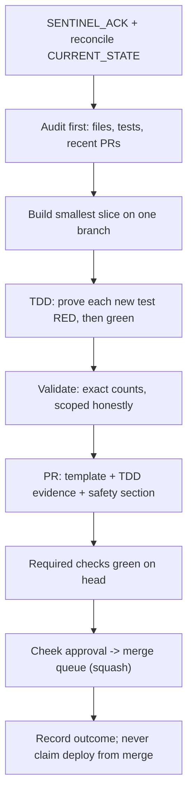

# Single-Builder Workflow Template

**Status:** Draft for Cheek approval. Describes process only — it grants no merge,
deploy, or role-reassignment power, and it does **not** by itself reassign the
builder role. The builder of record changes only when Cheek records the
reassignment in `docs/agents/CURRENT_STATE.md`.

**Provenance:** Distilled 2026-08-18 from the working pattern Codex established
as Implementation and Integration Lead — the role contract
(`docs/agents/roles/codex.md`), the process docs it plugs into
(`merge-queue.md`, `cheek-approval-workflow.md`), and the per-PR discipline
visible in shipped Codex PRs (e.g. #1019, #1021). Cheek asked for that pattern
to be captured as the template for single-builder operation, for use when one
agent (whichever Cheek designates) carries the build lane alone.

**Alignment note:** This doc is not one of the twelve Sentinel-versioned
governance files. If the constitution's ship-authority or startup-gate rules
change, update this file to match `AGENTS.md`; `AGENTS.md` controls any
conflict.

---

## 1. What stays true regardless of who builds

- **Cheek is sole ship authority.** The builder recommends and requests enqueue;
  only Cheek approves what ships (`cheek-approval-workflow.md`).
- **The startup gate applies.** Every session begins with `SENTINEL_ACK` after
  reading `AGENTS.md`, `CURRENT_STATE.md`, and the builder's role file.
- **The deploy branch is `verdant-grow-diary`.** `main` never establishes
  production behavior. A merge is not a deployment.
- **Hard safety rules are not workflow-optional.** No fake live data, no blind
  automation, approval-required Action Queue, migration immutability, secrets
  never in sessions — all of `AGENTS.md` §Hard Safety Rules binds the builder.
- **Status vocabulary is literal.** All eight of `AGENTS.md` §Status
  Vocabulary: `PASS` / `FAIL` / `BLOCKED` / `NO_BASELINE` / `NO_DATA` /
  `NOT_MEASURED` / `SKIPPED` / `NOT_APPLICABLE` — never launder a blocked or
  unmeasured check into a pass.

## 2. The slice loop

One slice at a time, smallest safe change, in this order:



Step rules:

1. **Reconcile before obeying.** If the assigned task conflicts with
   `CURRENT_STATE.md`, report the stale state; do not silently follow either.
2. **Audit before building.** Inspect the real shipping code, its tests, and
   recent merged/open PRs. Reuse a shipped implementation instead of building a
   competing one. (Single-builder mode makes collisions rarer, not impossible —
   Lovable and owner sessions still write to this repo.)
3. **One branch per slice**, named `<agent>/<kebab-slice-name>`, one PR,
   ideally one commit. A large PR is acceptable only when the slice is
   genuinely irreducible (e.g. a forward-repair migration plus its harness,
   preflight verifier, runbook, and tests — the #1021 shape).
4. **Business logic in pure typed modules**, presenter-only UI, no rule tables
   in JSX, per `AGENTS.md` §Architecture Rules.

## 3. The PR body contract

Every non-trivial PR fills the repo template
(`.github/pull_request_template.md`) **and** carries these four sections in its
summary — this is the core of the Codex discipline and the part most worth
keeping verbatim:

| Section          | Contract                                                                                                                                                                                                                                                                                            |
| ---------------- | --------------------------------------------------------------------------------------------------------------------------------------------------------------------------------------------------------------------------------------------------------------------------------------------------- |
| **Summary**      | Bullet list of what changed, behavior-first, few lines.                                                                                                                                                                                                                                             |
| **TDD evidence** | Each new test shown RED before its fix, with the failing count or symptom (e.g. "numeric query RED: 7 passed / 1 failed"). A test that was never seen failing is not evidence.                                                                                                                      |
| **Validation**   | Exact counts, scoped honestly: focused Vitest `N/N`, typecheck, scoped ESLint with pre-existing warnings counted separately, Prettier, `git diff --check`, and mocked-browser E2E where UI changed. Name what was **not** run.                                                                      |
| **Safety**       | Explicit statement: schema / RLS / auth / billing / production data / device control touched or not. Name the browser lane actually used — `chromium-mocked` (fake session, mocked Supabase) or `chromium-authed` (seeded session per §4) — and never paste real credentials into an agent session. |

Docs-only PRs state the docs-only exception in Tests-run instead of pretending
suites ran.

## 4. Validation ladder

Local, before every push (from the repo's real scripts — see
`.claude/skills/run-verdant-grow-diary/SKILL.md` for environment gotchas):

```bash
bun run typecheck
bunx vitest run <focused files>        # exact counts into the PR body
npx eslint <changed files>              # scoped to the diff; count pre-existing warnings separately (bun run lint is repo-wide)
# UI slices: mocked-browser proof against the dev server
E2E_BASE_URL=http://127.0.0.1:8080 bunx playwright test --project=chromium-mocked <spec>
```

The full suite runs in CI as 32 shards; do not claim "full suite green"
locally unless it was actually run. Authenticated browser proof uses the
seeded-session `chromium-authed` path with env-var credentials in a session the
owner controls — credentials are never pasted into an agent session.

## 5. Merge path

- Required checks (ruleset + queue): `Lint, typecheck, test, build`,
  `Preflight — edge shared-lib mirror in sync`, `test:legal-seo`,
  `Full test suite (shard 1/32)`…`(32/32)`.
- After Cheek approval: **merge queue, squash** — never a direct merge while
  the ruleset is active (`docs/agents/merge-queue.md`). Green checks from a
  pre-queue SHA do not count.
- Non-required reds stay visible and owned; they are not queue blockers and
  not pretend-passes.
- The conflict rule survives single-builder mode unchanged:

```text
Same complete intent already on base → CLOSE SUPERSEDED
Never hybrid-patch only to become mergeable
Never reuse green checks from pre-resolution SHA
```

## 6. What changes in single-builder mode

Adaptations from the multi-agent constitution — trims of ceremony, not of
discipline:

| Multi-agent practice                                                             | Single-builder adaptation                                                                                                                                                                                                                                                                                         |
| -------------------------------------------------------------------------------- | ----------------------------------------------------------------------------------------------------------------------------------------------------------------------------------------------------------------------------------------------------------------------------------------------------------------- |
| Check open PRs for a competing agent's implementation of the same slice          | Keep the audit; the competitor is now past-you, Lovable, or an owner session. Supersession rules unchanged.                                                                                                                                                                                                       |
| Serial role handoffs (Research → Architecture → Build → Security → QA → Council) | Cheek may invoke any subset; the builder must still **flag** slices that need a security review (new trust boundary, credential, or principal) rather than absorbing that judgment.                                                                                                                               |
| Codex "coordinates release gates, production verification, merge-on-green"       | This clause must be **explicitly transferred** in `CURRENT_STATE.md` at handoff. Until Cheek records it, the successor builder builds but does not coordinate release gates.                                                                                                                                      |
| DIRTY-PR reconciliation sweeps across agents                                     | Mostly vestigial; the builder keeps their own branch/PR hygiene: triage every stale branch to a terminal disposition and hand Cheek the deletion list — agent push credentials are branch-scoped (`git push --delete` → HTTP 403), so deletion itself is an owner action (the 2026-08-18 sweep is the reference). |
| Agent-attribution headers in `CURRENT_STATE.md` merge-conflict chains            | Same discipline, fewer collisions: additive header, demote prior, state exactly what was and was not re-measured.                                                                                                                                                                                                 |

**Unchanged and non-negotiable in single-builder mode:** Cheek approval,
merge queue, migration immutability, Sentinel gate, evidence labels, and the
rule that a builder session never holds production credentials.

## 7. Handoff checklist (previous builder → successor)

The outgoing builder's handoff document should give the successor, at minimum:

- [ ] Open PRs with per-PR state (required-CI status, review threads, queue
      position) and the intended next action for each
- [ ] In-flight slices not yet PR'd: branch, intent, what is proven vs pending
- [ ] Active approved slices from `CURRENT_STATE.md` with their `BLOCKED`
      owner-side gates, so nothing is re-litigated or rebuilt
- [ ] Known non-required reds and their owners
- [ ] Environment facts a fresh session will hit (install bootstrap, ports,
      seeded-session path) — or a pointer to the run skill
- [ ] Explicit list of what the successor must **not** do (parked PRs,
      abandoned branches, REJECT-fenced areas)

Cheek then records the role reassignment in `CURRENT_STATE.md`; the successor
acknowledges it in their next `SENTINEL_ACK`.

## 8. Document control

| Field                          | Value                                                                                                                       |
| ------------------------------ | --------------------------------------------------------------------------------------------------------------------------- |
| Type                           | Process template                                                                                                            |
| Grants merge/deploy to agents? | **No**                                                                                                                      |
| Reassigns the builder role?    | **No** — Cheek records reassignment in `CURRENT_STATE.md`                                                                   |
| Implementation code changes?   | None by this doc                                                                                                            |
| Success metric                 | Any designated builder can run the lane with the same evidence discipline Codex established, with zero loss of safety rules |
