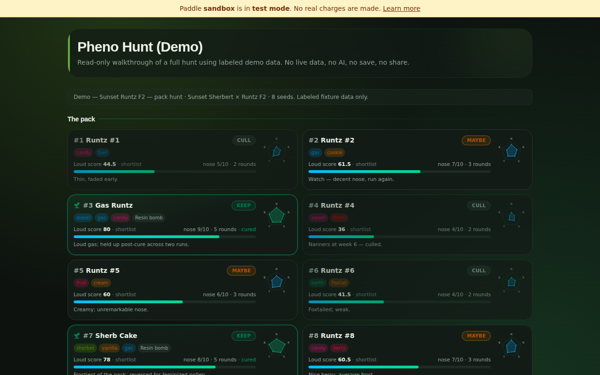
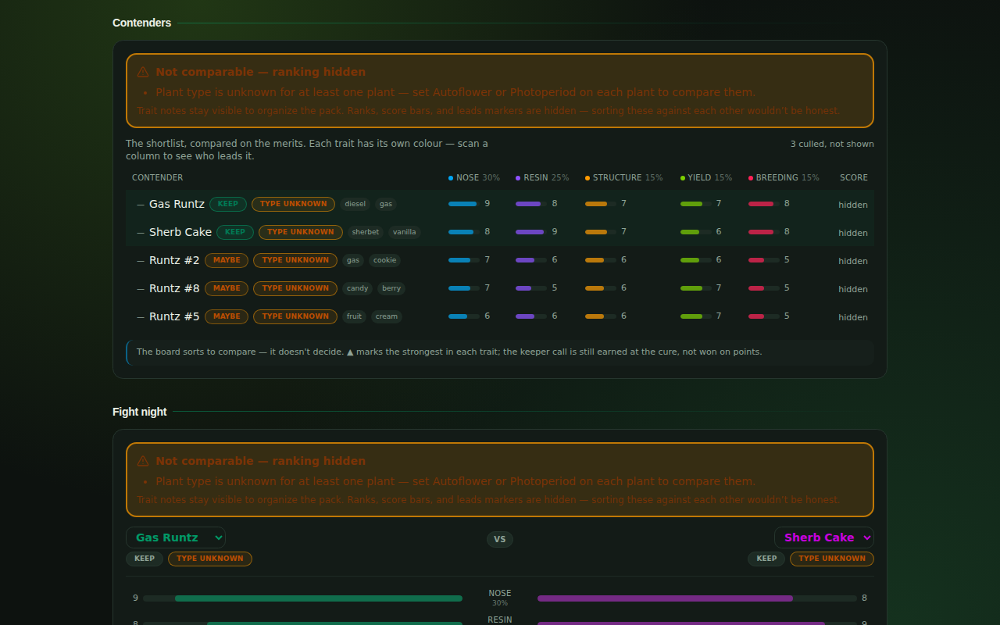
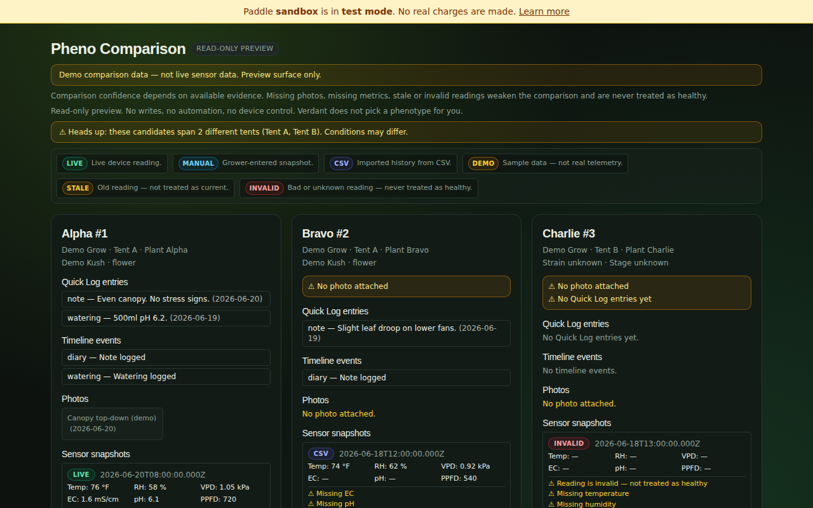
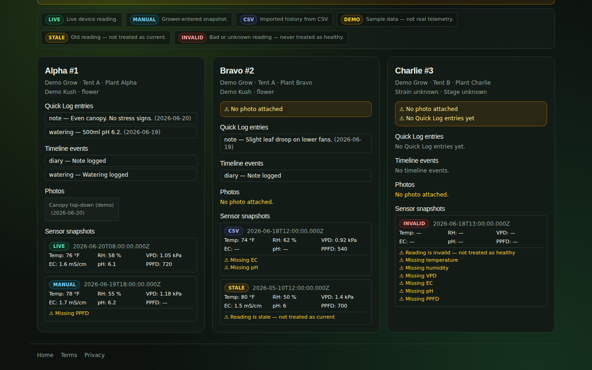
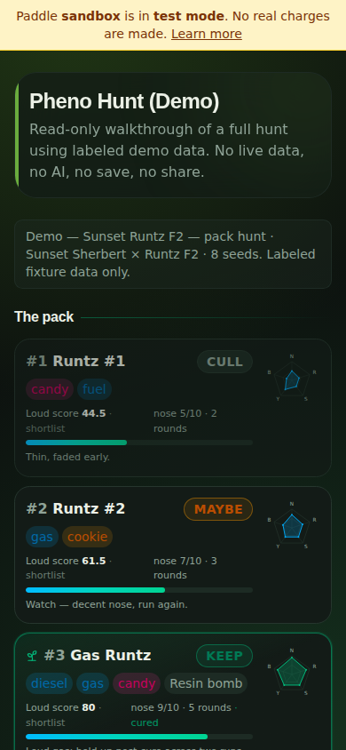
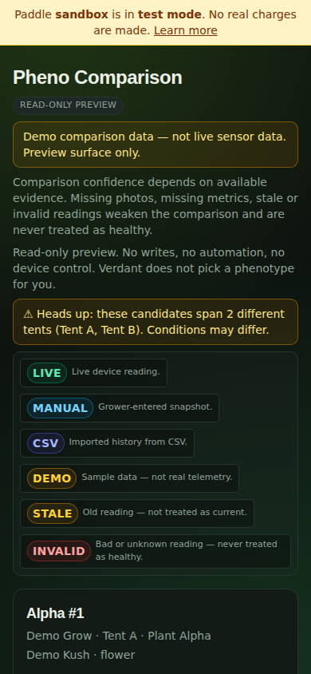

# Pheno Hunt + LAB — visual evidence (2026-08-26)

Captured from the running app on branch `claude/verdant-pheno-hunt-lab-vq6pd9`
(the draft PR for the Pheno Hunt + LAB territory). Desktop shots are 1280×800;
mobile shots are 390×844. All demo surfaces shown carry their "not live" /
labeled-fixture banners — nothing here presents demo data as real.

## Demo pack — `/internal/pheno-hunt-demo` (1280×800)

Labeled fixture data; KEEP/CULL/MAYBE badges are the grower's own recorded
calls, not system output.

## Contenders board — `/internal/pheno-hunt-demo`, scrolled (1280×800)

Partial scores render as n/5 chips; unscored candidates list last, unranked.

## Comparison top — `/pheno-comparison` (1280×800)

Source legend (live/manual/csv/demo/stale/invalid), read-only preview banner,
tent-mismatch caution.

## Comparison evidence detail — `/pheno-comparison`, scrolled (1280×800)

Photos with dates; honest empty/missing evidence states.

## Mobile 390×844 — demo

## Mobile 390×844 — comparison

