# Daily Walk + Closed Learning Loop Architecture

| Document field   | Value                                                                                             |
| ---------------- | ------------------------------------------------------------------------------------------------- |
| Status           | Approved product direction; architecture and sequencing contract only                             |
| Runtime impact   | None                                                                                              |
| Primary audience | Growers, product, design, cultivation review, engineering, and QA                                 |
| Scope            | One-tent daily operation first; multi-room and commercial capabilities are progressive extensions |

This specification turns Verdant from a collection of grow records into a Grow
Room Operating System organized around the work that happens during a real room
walk. It preserves the existing safety spine:

> Plant memory. Sensor truth. Grower-approved decisions.

The product is not an autopilot. It helps a grower capture what happened, see
what changed, decide what to do, record the result, and carry the lesson into the
next run.

This document does not authorize schema, RLS, RPC, Edge Function, entitlement,
AI-credit, Action Queue, device-control, or navigation changes. Each runtime
slice requires its own audit, decision record, tests, and promotion gate.

## 1. Product decision

Verdant's primary experience is the **Daily Walk**, followed by a **Closed
Learning Loop**:

```text
Prepare the room walk
  -> Observe each plant and the room
  -> Capture photo, note, irrigation, scouting, and manual evidence
  -> Close the walk and identify what changed
  -> Ask AI Doctor after the walk, when requested
  -> Grower chooses whether a suggestion becomes an Action Queue candidate
  -> Grower approves and performs the action outside Verdant
  -> Grower records the follow-up and outcome
  -> Grower decides repeat / avoid / adjust / monitor
  -> The next run starts with those decisions in context
```

The Daily Walk is the daily driver. Dashboard, Timeline, AI Doctor, reports,
genetics, and harvest analysis support that loop; they do not compete with it.

## 2. Non-negotiable safety spine

Every phase inherits these rules:

1. **The grower is the final authority.** Verdant may summarize, compare,
   suggest, and prepare a candidate. It does not decide what was done.
2. **No device control.** No fan, light, irrigation, dosing, HVAC, CO2, or other
   equipment commands are produced or executed.
3. **No blind automation.** No AI output, alert, sensor rule, or offline process
   creates or approves an Action Queue item without an explicit grower gesture.
4. **No fake live data.** Stored sensor source values use the existing canonical
   vocabulary: `live`, `manual`, `csv`, `demo`, `stale`, `invalid`.
5. **Unknown or bad telemetry fails closed.** It cannot become healthy or raise
   AI confidence.
6. **Timing is not causation.** A change observed after an action is evidence in
   a time window, not proof that the action caused the change.
7. **Offline does not mean secretly synced.** Device-captured, queued,
   cloud-accepted, conflicted, and failed states are visibly different.
8. **Exact scope is immutable during a save.** The target shown to the grower is
   the target written for the captured event. The app never silently retargets
   an event because a plant was archived, merged, moved, or unavailable.
9. **Entitlements and AI credits stay server-authoritative.** Offline UX cannot
   grant paid capabilities or spend credits on the client's word.
10. **Current release priorities remain in force.** The One-Tent Loop must be
    trustworthy before multi-room, breeding, commercial, or self-hosted
    capabilities enter grower navigation.

## 3. Architecture decision: local-first evidence, server-authoritative state

“Local-first” has a deliberately narrow meaning in Verdant.

The device is authoritative for an **unsynced capture the grower just made**.
Supabase is authoritative for **accepted durable records, identity, ownership,
RLS, entitlements, AI credits, roles, and cross-device state**.

This is an offline evidence outbox, not a second authorization system and not a
forked database.

```mermaid
flowchart LR
    UI["Daily Walk presenters"] --> VM["Pure state machine and view models"]
    VM --> CAP["Capture service"]
    CAP --> OUT["Encrypted local outbox"]
    OUT --> SYNC["Idempotent sync adapter"]
    SYNC --> AUTH["Authenticated Supabase API and RLS"]
    AUTH --> DATA["Accepted plant memory"]
    DATA --> REVIEW["Timeline, close-out, AI Doctor, learning review"]
    REVIEW -->|"explicit grower gesture"| AQ["Approval-Required Action Queue"]
    AQ -->|"grower-approved and manually performed"| FOLLOW["Follow-up and outcome"]
    FOLLOW --> REVIEW
```



| Concern                     | Device responsibility                                     | Server responsibility                                    |
| --------------------------- | --------------------------------------------------------- | -------------------------------------------------------- |
| Fast room-walk capture      | Save immediately to an encrypted local draft/outbox       | Accept idempotently when reachable                       |
| Target context              | Freeze the exact grow/tent/plant tuple shown at capture   | Verify the authenticated grower owns the complete tuple  |
| Photos                      | Retain the local asset, hash, metadata, and upload state  | Store the accepted object and durable evidence reference |
| Manual snapshots            | Preserve `source=manual` and original `captured_at`       | Validate scope, value, unit, and timestamp               |
| Identity and account switch | Bind local records to the authenticated account key       | Authenticate the session and enforce ownership           |
| Billing and AI credits      | Display last-known presentation state only                | Decide capabilities, reserve/spend/refund credits        |
| Conflict resolution         | Show a blocked review state; never silently retarget      | Return a stable reason and current authoritative state   |
| Multi-device history        | Show accepted cache plus this device's pending items      | Reconcile accepted records across devices                |
| Hardware ingestion          | Do not turn the browser into an unreviewed sensor gateway | Continue through approved authenticated ingest contracts |

### 3.1 What may be captured offline

The first offline boundary is intentionally small:

- Quick Log observations and structured event drafts
- photo assets and their local metadata
- manual sensor snapshots
- Daily Walk progress and close-out notes

The following stay online/server-authoritative:

- authentication and account changes
- plan/capability decisions and AI-credit reservation
- AI model calls
- Action Queue creation, approval, completion, and audit history
- alert persistence
- shared role or facility changes
- hardware ingest authorization
- destructive mutations

Hardware bridges may maintain their own bounded retry spool under an approved
ingest contract. That spool is not the browser outbox and cannot introduce new
sensor source labels.

### 3.2 Outbox record contract

Every offline-capable capture needs, at minimum:

- a device-generated `client_operation_id`
- an authenticated account binding
- schema/payload version
- exact `grow_id`, `tent_id`, and `plant_id` when the event is plant-scoped
- event kind and grower-entered payload
- original `captured_at` plus a separate local-created timestamp
- local asset references and content hashes when photos are present
- sync state, attempt count, and last safe reason code
- no access tokens, service-role keys, bridge secrets, or raw provider errors

Conceptual states:

```text
draft -> queued -> syncing -> accepted
                   |    |
                   |    -> retryable_error -> queued
                   -> blocked_conflict -> grower review
```

`accepted` requires an authoritative server acknowledgment containing the
server record identity and accepted timestamp. A client toast is not an
acknowledgment.

### 3.3 Idempotency and conflicts

The sync endpoint must make `client_operation_id` idempotent within the
authenticated owner boundary. A retry returns the same accepted record; it does
not create another diary event or photo.

| Situation                                    | Required result                                                                       |
| -------------------------------------------- | ------------------------------------------------------------------------------------- |
| Same operation retried                       | Return the original acceptance; create nothing new                                    |
| Network fails after server commit            | Retry safely and recover the original acceptance                                      |
| Photo uploads but event commit fails         | Retry/reconcile without duplicating the asset or event                                |
| Plant is archived, merged, or out of scope   | Block for review; never select another plant                                          |
| Tent/grow/plant tuple no longer agrees       | Block for review; never rewrite the tuple                                             |
| Manual snapshot arrives late                 | Keep original `captured_at` and `manual`; never label it Live                         |
| Event stage differs from current grow stage  | Preserve captured context and surface the difference; do not silently rewrite history |
| Existing accepted event was edited elsewhere | Require an explicit merge or keep-server/keep-local decision                          |
| Accepted event was deleted elsewhere         | Do not resurrect it automatically                                                     |
| User signs into another account              | Quarantine or clear the first account's local data; never cross-sync                  |

Stage normalization continues to treat `cure` and `curing` as the existing
`drying` stage alias. A new offline model must not fork the stage vocabulary.

### 3.4 Technology shape

The first client remains the existing React/Vite web application, installed as
a PWA where supported.

- Put the outbox behind a typed storage interface. Use IndexedDB for the web
  adapter; do not call IndexedDB directly from React components.
- Keep sync selection, retry, idempotency, and conflict transitions in pure
  modules with an injected clock and network adapter.
- Store photo blobs separately from event metadata and address them by a
  content hash plus local asset ID.
- Cache a versioned application shell in the service worker. Do not cache
  authenticated API responses, signed photo URLs, entitlement responses, or AI
  output as if they were public static assets.
- Treat browser Background Sync as an optimization. A foreground outbox drain
  on app open, reconnect, and grower request is the required path.
- Add a Capacitor/SQLite adapter only if measured PWA camera, storage,
  notification, or background reliability is insufficient. It must implement
  the same outbox contract; native packaging does not create a second domain
  model.
- Consider React Native only if the shared contract cannot meet the measured
  room-walk requirements. Do not rewrite the product for speculative native
  benefits.

The current repository has no general IndexedDB outbox, app-shell service
worker, or conflict-aware sync foundation. Offline support must therefore be
introduced as an audited capability, not advertised from browser cache
behavior.

### 3.5 Local data security and loss handling

Local evidence can contain sensitive grow and location context. Requirements:

- encrypt local payloads and assets with a device/account-bound key where the
  platform permits it
- use a strict CSP and dependency review because browser-side encryption does
  not protect data from code executing inside a compromised origin
- never persist auth refresh tokens, service keys, bridge secrets, or signed
  object URLs inside outbox payloads
- detect quota pressure before accepting large photo batches and show a safe
  storage warning
- retain blocked conflicts until the grower resolves, exports, or explicitly
  discards them
- on logout with pending evidence, offer **Sync now**, **Keep quarantined on
  this device**, or **Discard with confirmation**; never silently lose or
  cross-account sync the records
- clear accepted caches according to the privacy policy without deleting
  unacknowledged evidence behind the grower's back

## 4. Daily Walk experience

The target surface is a one-handed mobile workflow for growers carrying a
phone, wearing gloves, and moving through poor connectivity. Desktop remains
the stronger review and planning surface.

### 4.1 Walk setup

The grower starts with an exact active Grow and Tent. Verdant shows:

- the plants in that scope
- last accepted activity and this device's pending captures separately
- unresolved alerts or approved follow-ups, without implying the room is safe
- sensor freshness and source, with unavailable data shown as unavailable
- the last walk's grower-recorded changes

No Grow name is required by fixture validation until the product UI requires
it; Tent and Plant remain the hard target requirements for the current loop.

### 4.2 Plant pass

For each plant, the dominant interaction is the camera. The minimum useful
capture is one of:

- photo
- short observation
- structured irrigation event
- structured scouting/IPM observation
- manual environmental or root-zone snapshot

The plant remains visibly pinned through capture, local commit, and sync.
Changing the selected plant starts another capture; it cannot mutate the one
already in flight.

### 4.3 Fast capture and enrichment

Capture is two-phase:

1. **Fast capture:** record the evidence in three to five seconds.
2. **Enrichment:** add structure during the walk or later from the review
   surface.

Smart defaults may be offered only as visible, editable suggestions. A default
must never silently choose a different plant. Photos from a copied event are
never reused as new evidence.

Voice-to-text is optional input. It must show the transcript before commit and
must not turn spoken words into an Action Queue item or equipment instruction.

### 4.4 Walk close-out

Close-out answers four questions:

1. What changed since the last accepted walk?
2. What did the grower record on this walk?
3. What evidence is incomplete, pending sync, stale, invalid, or conflicted?
4. What deserves review after leaving the room?

The grower may finish a walk with pending offline captures. The summary must
say **Captured on this device** until the server accepts them. Existing Daily
Grow Check behavior remains server-backed; pending local evidence must not be
misrepresented as a durable completed check.

AI Doctor runs after close-out or on demand, never as a blocking capture modal.

### 4.5 Walk state contract

The walk session and its individual captures have separate states. Closing a
walk does not pretend every queued capture has synced.

```text
not_started -> active -> closed_on_device -> synced
                    |             |
                    |             -> needs_review
                    -> abandoned_with_confirmation
```

- `active`: the grower can move among in-scope plants and add captures.
- `closed_on_device`: the grower finished the physical pass; one or more items
  may still be queued.
- `synced`: every required capture has a server acceptance.
- `needs_review`: at least one capture is blocked or conflicted; accepted items
  stay accepted.
- `abandoned_with_confirmation`: an explicit grower decision; queued captures
  are handled individually and are not silently deleted.

The UI may say **Walk finished on this device** for `closed_on_device`. Only
`synced` may say **Walk synced**. Neither state says the plants are healthy.

## 5. First-class cultivation records

The existing Grow -> Tent -> Plant hierarchy stays. The following records are
added progressively because they are the evidence required to improve later
runs. These are domain contracts, not approved table definitions.

### 5.1 Genetics, pheno, and clone lineage

- seed lot, cultivar, breeder/source, and acquisition notes
- mother/donor plant and clone generation
- pheno identifier and grower selection notes
- explicit parent/child lineage edges with correction audit history
- performance history linked across grows without collapsing plants into one
  record

Verdant never infers parentage or keeper/cull decisions from names, photos, or
scores. Lineage is grower-asserted. Existing breeding workbooks remain
docs/offline tools until their published implementation gates pass.

### 5.2 Irrigation events

An irrigation event needs more than “watered”:

- target scope and event time
- solution volume and application method
- input pH and EC/PPM with explicit units
- runoff volume/percentage, pH, and EC when measured
- substrate/container context
- grower-entered recipe or nutrient reference
- pre/post weight or moisture evidence when actually available
- source and confidence for every measurement

User-confirmed irrigation is the boundary of record. A weight jump may support
that boundary but cannot invent one. Dryback remains a calculation-only future
capability and never closes the loop into an irrigation command.

The existing typed `grow_events`/`watering_events` path must not be connected to
Quick Log until its authenticated runtime RLS checklist passes. Until then,
diary-first behavior remains authoritative.

### 5.3 IPM and scouting close-outs

Scouting records should support:

- inspected locations and sample size
- pest/disease/beneficial category
- grower-recorded pressure or severity rubric
- photo evidence and affected plants/zone
- intervention performed, if any, recorded as history rather than advice
- product/lot/rate, applicator, PPE, re-entry, and pre-harvest metadata when the
  operator is required to track them
- follow-up date and grower-recorded close-out

Verdant must not invent pesticide directions or assert regulatory compliance.
Requirements vary by jurisdiction and licensed operation; the grower/operator
owns the record and decision.

### 5.4 Environment targets and actuals

- versioned target bands by stage, room, and optionally cultivar
- temperature, humidity, VPD, PPFD, CO2, root-zone, and schedule context when
  available
- actual readings with canonical source, captured time, quality/confidence,
  scope, and safe vendor lineage
- explicit gaps when a metric or trustworthy reading is absent

Targets are not actuals. A target can guide comparison but cannot turn stale or
invalid telemetry into healthy evidence.

### 5.5 Harvest, cure, and outcome records

- harvest scope and timestamps
- wet weight, dry weight, usable grade, trim loss, and waste with explicit units
- cure/batch linkage and checkpoints
- grower quality assessment
- external lab results with source, sample identity, and report provenance
- cultivar/pheno linkage back to the plant and lineage record

No yield number is comparable until scope, units, and denominator are explicit.
Tent totals, plant totals, and batch totals must not be silently mixed.

### 5.6 Post-grow reflection

Every completed grow should close with grower-owned answers:

- what worked
- what failed or remained uncertain
- what to repeat
- what to avoid
- what to adjust
- what to monitor next run

Current post-grow reflection work is operator-only and non-persistent. A
grower-facing version requires a separate privacy, persistence, and safety
decision. It must preserve the existing non-causal learning contract.

## 6. Closed Learning Loop

The canonical learning episode is:

```text
Observation/evidence
  -> AI or deterministic suggestion (optional)
  -> grower explicitly creates an Action Queue candidate (optional)
  -> grower approves, rejects, or edits
  -> grower performs the action outside Verdant
  -> follow-up evidence window
  -> grower records outcome
  -> system compares evidence cautiously
  -> grower chooses repeat / avoid / adjust / monitor
  -> next-run playbook
```

The system keeps these facts separate:

- what the grower observed
- what sensors recorded
- what AI suggested
- what the grower approved
- what the grower says they performed
- what changed afterward
- what the grower concluded

An AI suggestion does **not** automatically land in the Action Queue. The
grower must choose **Review as action**, inspect the proposed reason, risk, and
scope, and explicitly create the candidate. Approval is still a second,
audited grower decision.

## 7. AI architecture

### 7.1 Always-available baseline

The current deterministic, offline, confidence-capped AI Doctor foundation is
the fallback contract. It must remain usable without a model call and preserve:

- source-separated evidence
- explicit missing information
- confidence caps
- no single-photo certainty
- no aggressive changes from weak evidence
- no writes and no device control

### 7.2 Optional multimodal analysis

Stronger cloud or on-device models may be layered on only after the evidence is
captured and the grower requests analysis. Model output must pass the same
structured validation and confidence adapter as the baseline.

The analysis should compare, when available:

- current photo versus the same plant's prior photos
- this walk versus the previous accepted walk
- current run versus prior runs of the same grower-asserted cultivar/pheno
- actual environment versus the target version active at that time
- action follow-up versus the pre/post evidence windows

The model may say “I do not know” or request more data. It may not invent sensor
values, lineage, actions, outcomes, or causation.

### 7.3 Data minimization

AI and error reporting must exclude secrets and minimize private grow data.
Notes, plant/cultivar names, photo URLs, raw payloads, signed URLs, and location
metadata are not sent unless required by the explicit analysis and covered by
the product privacy contract. Session replay is off by default.

## 8. Progressive multi-room and facility mode

Multi-room is an extension of a proven single-room loop, not a different core.

Sequence:

1. One grow, one tent, individual plants, one grower.
2. Multiple tents for the same grower using the same Daily Walk contract.
3. Shared genetics library and cross-room comparisons.
4. Room-level assignments, handoffs, and IPM close-outs.
5. Roles such as owner, head grower, and technician with server-authoritative
   capabilities and audited writes.
6. Optional site/facility hierarchy and self-hosting evaluation for licensed
   operators.

No role may self-grant access. A facility dashboard must not flatten source,
freshness, unit, scope, or conflict state into a misleading green fleet score.

## 9. Information architecture

The future product is organized by the grower's work:

| Primary area | Question it answers                                                   |
| ------------ | --------------------------------------------------------------------- |
| Walk         | What needs my attention in this room right now?                       |
| Timeline     | What happened, in exact order, with what evidence?                    |
| Plants       | What is this plant's identity, lineage, and memory?                   |
| Rooms        | How are the scoped room and its evidence changing?                    |
| Actions      | What has the grower chosen to review, approve, perform, or follow up? |
| Learn        | What should this grower repeat, avoid, adjust, or monitor next run?   |
| Reports      | What can be exported without losing scope, provenance, or caveats?    |

Sensors and AI are evidence/services inside those jobs. They should not force
the grower to leave the Daily Walk to understand one plant.

## 10. Current-state reconciliation

This direction deliberately builds on existing contracts:

| Existing contract                    | Decision here                                                                                                           |
| ------------------------------------ | ----------------------------------------------------------------------------------------------------------------------- |
| `verdant-v0-product-spine.md`        | Preserve diary-first, sensors-second, AI-third, automation-last                                                         |
| `daily-grow-check-operating-loop.md` | Evolve into Daily Walk without faking a durable checked state                                                           |
| `manual-data-entry-optimization.md`  | Keep fast capture/enrichment and photo-first ergonomics; replace unsafe silent target defaults with exact visible scope |
| `one-tent-learning-loop-v1.md`       | Reuse explicit linkage, grower outcomes, and non-causal language                                                        |
| `action-outcome-analysis-v1.md`      | Reuse deterministic evidence comparison; never overwrite the grower's outcome                                           |
| `ai-doctor-phase1-contract.md`       | Preserve the offline baseline, confidence caps, and no-write boundary                                                   |
| Canonical sensor source modules      | Reuse the six source labels; do not create a parallel `source_tag` enum                                                 |
| Typed grow event tables              | Remain blocked from UI wiring until runtime RLS verification passes                                                     |
| Breeding workbooks                   | Supply future domain requirements, not current app navigation                                                           |
| Post-grow reflection phases          | Remain operator-only until a separate grower persistence decision                                                       |
| Dryback decision records             | Remain blocked/calculation-only; never trigger irrigation                                                               |

One repository document currently describes five sensor **display states** while
the canonical source modules and newer safety contracts define six stored
source labels including `csv`. Runtime work must import the canonical modules,
not copy either prose list. The documentation conflict should be reconciled in
its own narrow Trust Core slice; this specification does not invent a seventh
label or silently redefine CSV.

## 11. Delivery sequence and gates

Every phase is independently reversible and remains behind the One-Tent Loop
promotion gate.

### Phase 0 — Trust Core prerequisite

- exact route/display/write target integrity
- truthful loading, empty, stale, invalid, and error states
- sensor live-state classification at every render site
- client/server capability parity without changing the frozen entitlement lane
- mobile overflow and critical accessibility coverage
- authenticated walkthrough, runtime security harnesses, and independent review

**Exit:** The existing one-tent loop is trustworthy enough to extend. Open
Trust Core findings do not get hidden inside Daily Walk work.

### Phase 1 — Daily Walk online shell

- one exact grow/tent scope and sequential plant pass
- camera-first observation path using current accepted persistence
- walk close-out with accepted evidence only
- AI Doctor only after close-out/on demand
- no new schema and no offline claims

**Exit:** A grower can finish a real walk faster than the existing scattered
entry points, with zero target divergence and no false completion state.

### Phase 2 — Offline capture outbox

- versioned local evidence store
- encrypted account-bound records
- idempotent sync contract and conflict reasons
- queued/accepted/conflicted UI states
- photo retry/recovery
- logout/account-switch handling

**Exit:** The complete capture flow passes with the network disabled, then
syncs exactly once after reconnection. Destructive, billing, AI-spend, Action
Queue, and role operations remain online.

### Phase 3 — Structured room operations

- irrigation event detail and runtime RLS gate
- IPM/scouting capture and close-out
- versioned environment targets and actual comparison
- consistent photo evidence linkage

**Exit:** A room walk produces useful structured evidence without making the
minimum capture slow or turning observations into automation.

### Phase 4 — Harvest and closed learning

- explicit harvest/cure scopes and units
- grower-facing reflection persistence decision
- action/outcome/learning episode integration
- next-run playbook seeded from grower decisions

**Exit:** A completed run changes the context shown at the next run without
claiming causal proof.

### Phase 5 — Genetics memory

- lineage/pedigree model and correction audit
- cultivar/pheno performance comparisons across completed runs
- grower-authored selection decisions
- breeding analytics only after workbook gates pass

**Exit:** Cross-cycle comparisons use explicit lineage and sufficient scoped
evidence; no automatic keeper, cull, or breeding recommendation.

### Phase 6 — Multi-room progression

- shared library and cross-room views
- assignments and handoffs
- audited role capabilities
- facility and self-hosting discovery only after earlier gates hold

**Exit:** The single-room truth contracts remain identical under multiple
rooms and users.

## 12. Acceptance metrics

The architecture is successful only when these states are measurable.

| ID    | Outcome                                                                                                                | Verification                                                   |
| ----- | ---------------------------------------------------------------------------------------------------------------------- | -------------------------------------------------------------- |
| DW-01 | Median fast capture is at most 5 seconds after the target is visible                                                   | Instrumented usability run with representative mobile hardware |
| DW-02 | 100% of named entry points preserve the exact displayed grow/tent/plant tuple through accepted write                   | Route/target contract tests plus authenticated fixture run     |
| DW-03 | With network disabled, 100% of supported captures commit locally without data loss                                     | Browser/device offline integration suite                       |
| DW-04 | Replaying any queued operation produces no duplicate event or photo                                                    | Idempotency and lost-ack runtime harness                       |
| DW-05 | Archived, merged, moved, deleted, or out-of-scope targets are never silently replaced                                  | Conflict fixture matrix                                        |
| DW-06 | Pending evidence is never labeled accepted, synced, Live, or complete                                                  | Copy/static assertions and visual state tests                  |
| DW-07 | `demo`, `stale`, `invalid`, and unknown telemetry produce zero healthy/live render outcomes                            | Canonical sensor fixture matrix at every render site           |
| DW-08 | AI produces zero database, Action Queue, alert, billing, entitlement, or device writes                                 | Static boundary scans plus runtime audit                       |
| DW-09 | 100% of AI-to-Action handoffs require explicit candidate creation and separate approval                                | Interaction contract tests and audit receipt inspection        |
| DW-10 | Every learning statement distinguishes grower outcome, system comparison, missing evidence, and uncertainty            | Golden receipt/evaluation suite                                |
| DW-11 | Mobile widths 320, 360, 375, 390, and 430 have zero horizontal overflow and no FAB/bottom-nav collision                | CI viewport matrix using `scrollWidth - clientWidth = 0`       |
| DW-12 | Primary capture controls meet 44x44 target size, keyboard access, focus visibility, labels, and error association      | Automated accessibility checks plus manual screen-reader pass  |
| DW-13 | Account switching causes zero cross-account local record visibility or sync                                            | Two-account security harness                                   |
| DW-14 | Error telemetry contains zero notes, cultivar/plant names, photo URLs, raw payloads, tokens, or signed URLs by default | Sanitization fixture suite                                     |
| DW-15 | Each runtime slice has independent cultivation review, security review, rollback notes, and exact validation counts    | Promotion checklist                                            |

## 13. Explicit non-goals

The following are not part of the Daily Walk foundation:

- device control or closed-loop automation
- automatic irrigation, dosing, HVAC, CO2, or lighting changes
- automatic Action Queue creation or approval
- social feeds, competitions, public grow sharing, or gamified pressure
- a new sensor source taxonomy
- black-box diagnoses or confidence copied from a model
- 3D rooms, digital-twin decoration, or dashboard gimmicks
- enterprise fleet abstractions before the single-room loop is proven
- unreviewed pesticide or medical/legal compliance recommendations
- automatic keeper, cull, pheno, or breeding decisions

## 14. First implementation backlog

After the Trust Core promotion gate closes, the first build slice should be the
**Daily Walk online shell**, not local database infrastructure.

1. Audit the current Dashboard, Daily Check, Plant Detail, Quick Log, Photo,
   Timeline, and AI Doctor entry/return contracts.
2. Define a pure `DailyWalk` state machine and view model with injected time.
3. Add a single exact-scope walk route using current server persistence.
4. Reuse Quick Log/photo primitives while keeping target resolution outside
   JSX.
5. Add close-out based only on server-accepted evidence.
6. Run cultivation review in a real tent before designing offline storage.
7. Use observed capture failures to finalize the outbox payload and conflict
   contract.

This order prevents Verdant from hardening the wrong local data model before
the room-walk interaction is proven.

## 15. Safety verdict

**Safe to adopt as direction.** This specification keeps the grower in the
decision seat, narrows local-first behavior to recoverable evidence capture,
preserves server-authoritative security and cost controls, reuses canonical
sensor and stage vocabularies, and forbids automatic Action Queue or equipment
behavior.

**Not approved for runtime implementation as one broad project.** Build it as
small audited slices in the delivery order above.
